# mcp-decision-lab

<!-- mcp-name: io.github.AleBrito124356/mcp-decision-lab -->

[](https://github.com/AleBrito124356/mcp-decision-lab/actions/workflows/tests.yml)
[](LICENSE)

**MCP server for structured decision-making — weighted decision matrices, exact weight and score sensitivity, Monte Carlo robustness and a defensible, auditable recommendation.**

## Why

LLMs are good at listing pros and cons and then picking whatever "feels" right. That reasoning is opaque, unstable, and impossible to audit: change one adjective in the prompt and the answer flips. mcp-decision-lab is a *thinking tool*: the model uses it to structure its own reasoning as an explicit weighted decision matrix. Every score needs a written rationale, weights are normalized and visible, and `analyze` does real math instead of vibes:

- **Which weight would flip the winner, and at what value** (exact, closed form).
- **Which single judgment the decision hinges on**: the smallest change to any one score that changes the winner, quoted together with the rationale you gave for it.
- **How often the winner survives when everything is uncertain at once**: a seeded Monte Carlo that perturbs all weights and all scores together.
- **An honest verdict**: `robust`, `fragile`, or `tie`. A tie is never presented as a winner.

## Tools

| Tool | Arguments | Returns |
| --- | --- | --- |
| `start_decision` | `question`, `options` (≥2 strings), `criteria` (≥2 × `{name, weight > 0, higher_is_better = true}`) | `decision_id`, weights normalized to sum 1.0, the empty cells, next step |
| `score_option` | `decision_id`, `option`, `criterion`, `score` (0–10), `rationale` (≥10 chars) | The recorded cell, remaining cells, next step |
| `get_matrix` | `decision_id` | Raw, effective and weighted scores, totals, every rationale, missing cells |
| `analyze` | `decision_id`, optional `simulations` (default 2000, 0 = off), `seed` (7), `score_noise` (±1), `weight_concentration` (20) | Ranking and margin, weight sensitivity, score sensitivity, Monte Carlo, strengths/weaknesses, verdict, recommendation ([details](#what-analyze-returns)) |
| `what_if` | `decision_id`, optional `weights` `{criterion: w}`, optional `score_overrides` `[{option, criterion, score}]` | The ranking, totals, margin and winner under the hypothesis. **The stored session is never changed.** |
| `export_decision` | `decision_id`, `format` = `"markdown"` \| `"json"` | A decision record (ADR-style Markdown or JSON) with every rationale and the full analysis |
| `delete_decision` | `decision_id` | Removes the session from the store (marked `destructiveHint`) |
| `list_decisions` | — | Every session with its status (`pending` / `complete` / `analyzed`) and, once analyzed, the winner and verdict |

Every argument has a typed JSON schema: bounds, `minItems`, and a `Criterion` object with `additionalProperties: false`. Tools also carry MCP annotations (read-only, destructive, idempotent). When a call is rejected, the message is returned to the model verbatim (for example `Unknown option 'C'. Valid options: A, B.`) so it can correct itself.

Criteria where a high raw score is *bad* (cost, risk, complexity) take `"higher_is_better": false`. Score the raw quantity (cost 10 = very expensive) and the tool uses `10 - score` as the effective score.

## What `analyze` returns

| Field | Meaning |
| --- | --- |
| `ranking`, `winner`, `runner_up`, `margin` | Options by weighted total. Tied totals share a rank. |
| `tied` | Non-empty only for a tie at the top. Then `winner` is `null`, `robustness` is `"tie"`, and `sensitivity[].tie_break` tells you which option gains if each criterion's weight goes up or down. |
| `sensitivity` | Per criterion: the exact `flip_weight` at which another option takes over (the other weights keep their proportions), the direction, the new winner, and whether that change is within ±50% of the current weight. |
| `score_sensitivity` | For every cell, the score beyond which the winner changes (`flip_score`, `direction` `above`/`below`, `change_needed` in points), with that cell's rationale. `most_fragile` lists the 5 closest. Cells whose threshold falls outside 0–10 cannot flip the result. |
| `monte_carlo` | Per option: `win_probability` (rank-1 acceptability), the full `rank_acceptability`, `expected_rank`, and the 5th/50th/95th percentile of its total. |
| `robustness_checks` | The three checks behind the verdict (see below), each with pass/fail and what failed. |
| `strengths_weaknesses` | Each option's best and worst criterion, or `uniform: true` when it scores the same on all of them. |
| `recommendation` | A text summary built from all of the above. |

**Verdict rules.** `robust` means all three checks pass:

1. **Weights:** no ±50% relative change to any single criterion weight flips the winner.
2. **Scores:** no change of 1 point or less to any single score flips the winner.
3. **Monte Carlo:** the winner ranks first in at least 80% of the joint perturbations (skipped when `simulations=0`).

Otherwise the verdict is `fragile`, and the recommendation says which check failed and by how much. `tie` means the top options have equal totals.

## How it works

```mermaid
flowchart TD
    A[start_decision<br/>question + options + weighted criteria] --> B[weights normalized to sum 1.0<br/>session dec-xxxx saved to disk]
    B --> C[score_option x N<br/>score 0-10 + mandatory rationale]
    C -->|cells missing| C
    C -->|matrix complete| E[analyze]
    E --> F[ranking + margin<br/>tie detection]
    E --> G["weight sensitivity<br/>exact flip weight per criterion"]
    E --> H["score sensitivity<br/>smallest single-score change that flips it"]
    E --> M["Monte Carlo<br/>all weights + scores perturbed together"]
    F --> I[verdict: robust / fragile / tie]
    G --> I
    H --> I
    M --> I
    I --> J[recommendation naming the hinge cell]
    J --> K[what_if: test other weights or scores]
    J --> L[export_decision: Markdown decision record]
```



**Weight sensitivity.** Move criterion *c* from weight *w* to *w′* while the other criteria keep their relative weights. Every total is then linear in *w′*. For the winner A against a challenger B, `gap(w′) = w′·d + (1−w′)·r`, where `d` is their effective-score difference on *c* and `r` is their weighted difference on everything else. Solving `gap(w′) = 0` gives the exact flip weight `w* = r/(r−d)`. It is reported only if B strictly wins somewhere in `[0, 1]`. `r` is computed from the other criteria's relative weights and never by dividing by `1 − w`, so a criterion that carries essentially all of the weight is still exact.

**Score sensitivity.** Totals are linear in every cell. The runner-up takes over once the winner's effective score on *c* drops by more than `margin / w_c`. A challenger takes over once its own score rises by more than `(total_A − total_B) / w_c`. Inverted criteria are mapped back to raw scores.

**Monte Carlo.** Weights are drawn from a Dirichlet distribution centred on your weights (`α = concentration × w`), and every score gets independent uniform noise ±`score_noise`, clipped to 0–10. Every draw comes from `random.Random(seed).random()` alone (Marsaglia–Tsang gamma sampling on Box–Muller normals). `random()` is the one part of the `random` module whose output Python guarantees not to change between versions, so the same seed gives the same numbers on every supported Python.

## Install

> **Not on PyPI yet.** `pip install mcp-decision-lab` and `uvx mcp-decision-lab` will only work once the first release is published (`server.json` and the publish workflow are ready for it). Until then, install from GitHub:

```bash
# Run straight from GitHub with uv (nothing to install)
uvx --from git+https://github.com/AleBrito124356/mcp-decision-lab mcp-decision-lab

# Or install into any Python 3.10+ environment
pip install git+https://github.com/AleBrito124356/mcp-decision-lab
```

**Claude Desktop** (`claude_desktop_config.json`):

```json
{
  "mcpServers": {
    "decision-lab": {
      "command": "uvx",
      "args": ["--from", "git+https://github.com/AleBrito124356/mcp-decision-lab", "mcp-decision-lab"]
    }
  }
}
```

If you installed it with pip, use `"command": "mcp-decision-lab"` with no `args` (or the full path to that executable).

**Claude Code:**

```bash
claude mcp add decision-lab -- uvx --from git+https://github.com/AleBrito124356/mcp-decision-lab mcp-decision-lab
```

**From a source checkout:** `python -m mcp_decision_lab.server` (or `python -m mcp_decision_lab`).

**See it work without an MCP client:** `mcp-decision-lab demo` runs the example below in a temporary directory and prints the full analysis. It works offline.

## Command line

With no arguments, `mcp-decision-lab` serves MCP over stdio, which is how MCP clients launch it. The subcommands work offline:

| Command | What it does |
| --- | --- |
| `mcp-decision-lab` / `mcp-decision-lab serve [--data-dir DIR]` | Serve MCP over stdio |
| `mcp-decision-lab demo [--format text\|json\|markdown] [--simulations N]` | Run the database example below in a temporary store |
| `mcp-decision-lab list [--data-dir DIR] [--json]` | List stored sessions with status and result |
| `mcp-decision-lab report ID [--format md\|json] [-o FILE] [--data-dir DIR]` | Export a decision record |
| `mcp-decision-lab --version` | Package and MCP SDK versions |

## Example session

> **User:** Help me pick a database for the new SaaS backend — Postgres, MongoDB or DynamoDB. Cost matters most, then scalability, then how well the team knows it.

The model starts a session:

```python
start_decision(
    question="Which database should we use for the new SaaS backend?",
    options=["Postgres", "MongoDB", "DynamoDB"],
    criteria=[
        {"name": "cost", "weight": 0.5, "higher_is_better": False},
        {"name": "scalability", "weight": 0.3},
        {"name": "team-familiarity", "weight": 0.2},
    ],
)
# → {"decision_id": "dec-34b5", "cells_total": 9, "next_step": "Score each option ..."}
```

Then it scores all 9 cells, each with a rationale (`score_option("dec-34b5", "Postgres", "cost", 3, "Managed Postgres ...")`, and so on). Cost is a raw cost score where 10 = very expensive:

| Option | cost (lower is better) | scalability | team-familiarity |
| --- | --- | --- | --- |
| Postgres | **3** — Managed Postgres (RDS/Neon) is cheap and predictable at our scale | **6** — Vertical scaling plus read replicas covers years of growth; sharding is manual | **9** — Every backend engineer has run Postgres in production |
| MongoDB | **5** — Atlas is moderate at first but dedicated clusters get pricey fast | **7** — Built-in sharding scales writes horizontally with some tuning | **5** — Two engineers have used it; the rest only know tutorials |
| DynamoDB | **6** — On-demand pricing gets expensive with our read-heavy access patterns | **10** — Effectively unlimited managed horizontal scale | **4** — Only one engineer knows single-table design patterns |

And analyzes:

```python
analyze("dec-34b5")
```

Output, abridged: `monte_carlo.options` shows two of its six fields, and `most_fragile` shows the first two of five cells. Every number here is pinned by a test against `mcp-decision-lab demo --format json`.

```json
{
  "ranking": [
    {
      "rank": 1,
      "option": "Postgres",
      "total": 7.1
    },
    {
      "rank": 2,
      "option": "DynamoDB",
      "total": 5.8
    },
    {
      "rank": 3,
      "option": "MongoDB",
      "total": 5.6
    }
  ],
  "winner": "Postgres",
  "tied": [],
  "runner_up": "DynamoDB",
  "margin": 1.3,
  "sensitivity": [
    {
      "criterion": "cost",
      "weight": 0.5,
      "decisive": true,
      "flip": {
        "flip_weight": 0.1176,
        "direction": "decrease",
        "new_winner": "DynamoDB",
        "weight_change": -0.3824,
        "within_50pct_band": false
      }
    },
    {
      "criterion": "scalability",
      "weight": 0.3,
      "decisive": true,
      "flip": {
        "flip_weight": 0.4717,
        "direction": "increase",
        "new_winner": "DynamoDB",
        "weight_change": 0.1717,
        "within_50pct_band": false
      }
    },
    {
      "criterion": "team-familiarity",
      "weight": 0.2,
      "decisive": false,
      "flip": null
    }
  ],
  "decisive_criteria": [
    "cost",
    "scalability"
  ],
  "score_sensitivity": {
    "flippable_cells": 5,
    "cells_total": 9,
    "most_fragile": [
      {
        "option": "Postgres",
        "criterion": "cost",
        "current_score": 3.0,
        "flip_score": 5.6,
        "direction": "above",
        "change_needed": 2.6,
        "new_winner": "DynamoDB",
        "within_1pt": false,
        "rationale": "Managed Postgres (RDS/Neon) is cheap and predictable at our scale"
      },
      {
        "option": "DynamoDB",
        "criterion": "cost",
        "current_score": 6.0,
        "flip_score": 3.4,
        "direction": "below",
        "change_needed": 2.6,
        "new_winner": "DynamoDB",
        "within_1pt": false,
        "rationale": "On-demand pricing gets expensive with our read-heavy access patterns"
      }
    ]
  },
  "monte_carlo": {
    "simulations": 2000,
    "seed": 7,
    "score_noise": 1.0,
    "weight_concentration": 20.0,
    "options": {
      "Postgres": {
        "win_probability": 0.929,
        "expected_rank": 1.084
      },
      "MongoDB": {
        "win_probability": 0.003,
        "expected_rank": 2.576
      },
      "DynamoDB": {
        "win_probability": 0.068,
        "expected_rank": 2.34
      }
    }
  },
  "robustness": "robust",
  "robustness_checks": {
    "weights": {
      "passed": true
    },
    "scores": {
      "passed": true
    },
    "monte_carlo": {
      "passed": true
    }
  },
  "recommendation": "Choose Postgres (7.1 weighted) over DynamoDB (5.8); margin 1.3. Postgres is strongest on 'team-familiarity' (9/10) and weakest on 'scalability' (6/10). The result is robust: no ±50% relative change to any single criterion weight changes the winner, no single score is within 1 point of flipping it (the closest needs a 2.6-point change). (Extreme shifts could still flip it: 'cost' would have to decrease from 0.5 to 0.1176 for DynamoDB to win; 'scalability' would have to increase from 0.3 to 0.4717 for DynamoDB to win.) The decision hinges most on the judgment that Postgres scores 3 on 'cost' (\"Managed Postgres (RDS/Neon) is cheap and predictable at our scale\"): above 5.6, DynamoDB wins. Monte Carlo (2000 joint perturbations of all weights and scores ±1, seed 7): win probability Postgres 92.9%, DynamoDB 6.8%."
}
```

> **Model (to user):** Postgres wins at 7.1 weighted vs DynamoDB's 5.8, and the result is robust. No reasonable (±50%) shift in any single weight changes it. The closest single judgment is Postgres's cost score: if managed Postgres really costs above 5.6 on our scale instead of 3, DynamoDB wins. With all weights and scores wobbling at once, Postgres still comes first in 92.9% of 2,000 simulations. If you expect hockey-stick scale, revisit scalability's weight (DynamoDB overtakes above ~0.47). Otherwise Postgres is the defensible choice.

Probe the result without touching the session:

```python
what_if("dec-34b5", weights={"scalability": 0.5})
# cost and team-familiarity keep their 0.5 : 0.2 proportion over the remaining 0.5
# → {"winner": "DynamoDB", "winner_changed": true,
#    "summary": "Winner changes from Postgres to DynamoDB. Hypothetical margin 0.2143.", ...}

what_if("dec-34b5", score_overrides=[{"option": "Postgres", "criterion": "cost", "score": 6}])
# → {"summary": "Winner changes from Postgres to DynamoDB. Hypothetical margin 0.2.", ...}
```

In `weights`, name **every** criterion to give new relative importances (they are normalized). Name only **some** criteria to set their exact normalized weight (for example a `flip_weight` from `analyze`). The rest then share what is left in their current proportions.

Finally, `export_decision("dec-34b5")` or `mcp-decision-lab report dec-34b5` produces a Markdown decision record. It contains the question, the weights, the score table, every rationale, the ranking, both sensitivity tables, the Monte Carlo table and the recommendation. It is ready to paste into a PR or an ADR folder.

## Persistence and multiple clients

Sessions are stored in `~/.mcp-decision-lab/decisions.json`. Set `DECISION_LAB_DIR` or pass `--data-dir` to use another directory. Several server processes can share the same store, for example Claude Desktop and Claude Code at the same time:

- Every write runs under a cross-process lock file (`decisions.json.lock`, `O_CREAT | O_EXCL`, stdlib only). It re-reads the file, applies the one change, and writes atomically. Sessions created by other processes are never lost. A lock left behind by a crashed process is recovered after 30 s.
- Reads pick up changes made by other processes without a restart.
- A corrupt or foreign store file is never overwritten. Tools return a clear "Fix or delete the file" error, and the server keeps running.
- The file carries a format version. 0.1.x stores are migrated transparently, and a store written by a newer version is refused rather than damaged.

## Compatibility

- **Python** 3.10+.
- **MCP Python SDK** `>=1.5,<3`. Both lines are supported: mcp 2.x (`MCPServer`) and mcp 1.x (`FastMCP`). The full test suite, including the stdio tests, passes on mcp 2.2.0, 1.30.0 and 1.5.0. Tool annotations need mcp 1.6 or newer; on 1.5 the tools work without them. 1.4 and older have stdio transport bugs on Windows.

## Development

```bash
git clone https://github.com/AleBrito124356/mcp-decision-lab
cd mcp-decision-lab
python -m venv .venv
.venv/bin/pip install -e ".[dev]"      # Windows: .venv\Scripts\pip ...
.venv/bin/python -m pytest

# The same suite against the 1.x SDK line
.venv/bin/pip install "mcp<2" && .venv/bin/python -m pytest
```

| Test file | What it covers |
| --- | --- |
| `tests/test_core.py` | Validation, normalization, the original hand-computed sensitivity cases, status lifecycle |
| `tests/test_analysis.py` | Ties, extreme weights, score thresholds (checked by re-scoring across them), Monte Carlo properties, `what_if` |
| `tests/test_store.py` | Two instances sharing a store, a 4-process × 50-write stress test, corrupt stores, migration, stale and live locks |
| `tests/test_server.py` | A real MCP client in-process: schemas, the end-to-end flow, error messages reaching the model. Plus a stdio smoke test that launches the server as a subprocess |
| `tests/test_cli.py` | CLI commands, decision records, and a check that this README's example numbers match the code |

The core (`core.py`, `analysis.py`, `store.py`, `report.py`) is pure stdlib. `test_server.py` is skipped when the `mcp` package is not installed.

## Related MCP servers

Part of a family of small, dependency-light MCP servers:

- [mcp-devils-advocate](https://github.com/AleBrito124356/mcp-devils-advocate): stress-test a claim with devil's advocate, premortem and assumption audits
- [mcp-secret-sentinel](https://github.com/AleBrito124356/mcp-secret-sentinel): scan code for exposed secrets, always redacted
- [mcp-git-historian](https://github.com/AleBrito124356/mcp-git-historian): churn hotspots, blame summaries, bus factor
- [mcp-memory-vault](https://github.com/AleBrito124356/mcp-memory-vault): persistent memory with SQLite FTS5 search

## License

MIT
