# mcp-decision-lab


**MCP server for structured decision-making — weighted decision matrices, criteria scoring, sensitivity analysis and a defensible recommendation.**

## Why

LLMs are good at listing pros and cons and then picking whatever "feels" right. That reasoning is opaque, unstable, and impossible to audit: change one adjective in the prompt and the answer flips. mcp-decision-lab is a *thinking tool* — the model uses it to structure its own reasoning as an explicit weighted decision matrix. Every score requires a written rationale, weights are normalized and transparent, and the final `analyze` step does real math: exact (closed-form, not brute-force) sensitivity analysis that tells you **which criterion weight would flip the winner and at what value** — so the recommendation comes with a robustness verdict instead of vibes.

## Tools

| Tool | Arguments | Returns |
| --- | --- | --- |
| `start_decision` | `question: str`, `options: list[str]` (≥2), `criteria: list[dict]` (≥2, each `{"name", "weight", "higher_is_better"?}`) | New `decision_id`, criteria with weights normalized to sum 1.0, empty-cell list, next-step instruction |
| `score_option` | `decision_id`, `option`, `criterion`, `score: float` (0–10), `rationale: str` (≥10 chars, required) | The recorded cell, remaining missing cells, next step |
| `get_matrix` | `decision_id` | Full matrix: raw scores, effective scores, weighted scores, per-option totals, rationales, missing cells |
| `analyze` | `decision_id` (matrix must be complete) | Ranking + margin, per-criterion sensitivity (exact flip weight, direction, new winner, decisive flag), strengths/weaknesses per option, robustness verdict (`robust`/`fragile`), textual recommendation |
| `list_decisions` | — | All sessions with status: `pending` / `complete` / `analyzed` |

Criteria where a high raw score is *bad* (cost, risk, complexity) take `"higher_is_better": false` — the effective score becomes `10 - score` automatically.

## How it works

```mermaid
flowchart TD
    A[start_decision<br/>question + options + weighted criteria] --> B[weights normalized to sum 1.0<br/>session dec-xxxx persisted to disk]
    B --> C[score_option x N<br/>one cell = option x criterion,<br/>score 0-10 + mandatory rationale]
    C -->|cells missing| C
    C -->|matrix complete| D[get_matrix<br/>review raw / weighted scores]
    D --> E[analyze]
    E --> F[ranking + margin<br/>weighted totals]
    E --> G["sensitivity analysis<br/>closed-form flip weight per criterion:<br/>solve gap(w') = w'·d + (1-w')·r = 0"]
    E --> H[strengths / weaknesses<br/>best and worst criterion per option]
    F --> I[robustness verdict<br/>robust vs fragile under ±50% weight shifts]
    G --> I
    H --> I
    I --> J[defensible recommendation]
```



**The sensitivity math.** With normalized weights, changing criterion *c*'s weight from *w* to *w′* (renormalizing the others proportionally) makes every option's total **linear** in *w′*. For the winner A vs a challenger B the gap is `gap(w′) = w′·d + (1−w′)·r`, where `d` is their effective-score difference on *c* and `r` is their weight-scaled difference on everything else. Solving `gap(w′) = 0` gives the exact flip weight `w* = r/(r−d)` — reported only if a region of `[0, 1]` exists where the challenger strictly wins. If no ±50% relative change to any single weight flips the winner, the verdict is **robust**; otherwise **fragile**, naming the criteria the decision hinges on.

## Quickstart

```bash
pip install -e .
```

**Claude Desktop** — add to `claude_desktop_config.json`:

```json
{
  "mcpServers": {
    "decision-lab": {
      "command": "python",
      "args": ["/absolute/path/to/server.py"]
    }
  }
}
```

**Claude Code:**

```bash
claude mcp add decision-lab -- python /absolute/path/to/server.py
```

Sessions persist as JSON in `~/.mcp-decision-lab/decisions.json` (override the directory with the `DECISION_LAB_DIR` environment variable).

## Example session

> **User:** Help me pick a database for the new SaaS backend — Postgres, MongoDB or DynamoDB. Cost matters most, then scalability, then how well the team knows it.

The model starts a session:

```python
start_decision(
    question="Which database should we use for the new SaaS backend?",
    options=["Postgres", "MongoDB", "DynamoDB"],
    criteria=[
        {"name": "cost", "weight": 0.5, "higher_is_better": False},
        {"name": "scalability", "weight": 0.3},
        {"name": "team-familiarity", "weight": 0.2},
    ],
)
# → {"decision_id": "dec-34b5", "cells_total": 9,
#    "next_step": "Score each option against each criterion using score_option ..."}
```

Then scores all 9 cells, each with a rationale:

```python
score_option("dec-34b5", "Postgres", "cost", 3,
    "Managed Postgres (RDS/Neon) is cheap and predictable at our scale")
score_option("dec-34b5", "DynamoDB", "scalability", 10,
    "Effectively unlimited managed horizontal scale")
score_option("dec-34b5", "DynamoDB", "team-familiarity", 4,
    "Only one engineer knows single-table design patterns")
# ... 6 more cells ...
# → {"missing_cells": [], "next_step": "Matrix complete — call analyze('dec-34b5') ..."}
```

And analyzes:

```python
analyze("dec-34b5")
```

```json
{
  "ranking": [
    {"rank": 1, "option": "Postgres", "total": 7.1},
    {"rank": 2, "option": "DynamoDB", "total": 5.8},
    {"rank": 3, "option": "MongoDB", "total": 5.6}
  ],
  "winner": "Postgres",
  "margin": 1.3,
  "sensitivity": [
    {"criterion": "cost", "weight": 0.5, "decisive": true,
     "flip": {"flip_weight": 0.1176, "direction": "decrease",
              "new_winner": "DynamoDB", "within_50pct_band": false}},
    {"criterion": "scalability", "weight": 0.3, "decisive": true,
     "flip": {"flip_weight": 0.4717, "direction": "increase",
              "new_winner": "DynamoDB", "within_50pct_band": false}},
    {"criterion": "team-familiarity", "weight": 0.2, "decisive": false, "flip": null}
  ],
  "decisive_criteria": ["cost", "scalability"],
  "robustness": "robust",
  "recommendation": "Choose Postgres (7.1 weighted) over DynamoDB (5.8); margin 1.3. Postgres is strongest on 'team-familiarity' (9/10) and weakest on 'scalability' (6/10). The result is robust: no ±50% relative change to any single criterion weight changes the winner. (Extreme shifts could still flip it: 'cost' would have to decrease from 0.5 to 0.1176 for DynamoDB to win; 'scalability' would have to increase from 0.3 to 0.4717 for DynamoDB to win.)"
}
```

> **Model (to user):** Postgres wins at 7.1 weighted vs DynamoDB's 5.8, and the result is robust: no reasonable (±50%) shift in any single weight changes the winner. It would take valuing scalability at ~0.47 instead of 0.3 — or cost dropping below ~0.12 — for DynamoDB to overtake. If you genuinely expect hockey-stick scale, revisit; otherwise Postgres is the defensible choice.

## Development

```bash
pip install -e ".[dev]"
python -m pytest
```

Tests exercise `core.py` only and run without the `mcp` package installed.

## License

MIT
